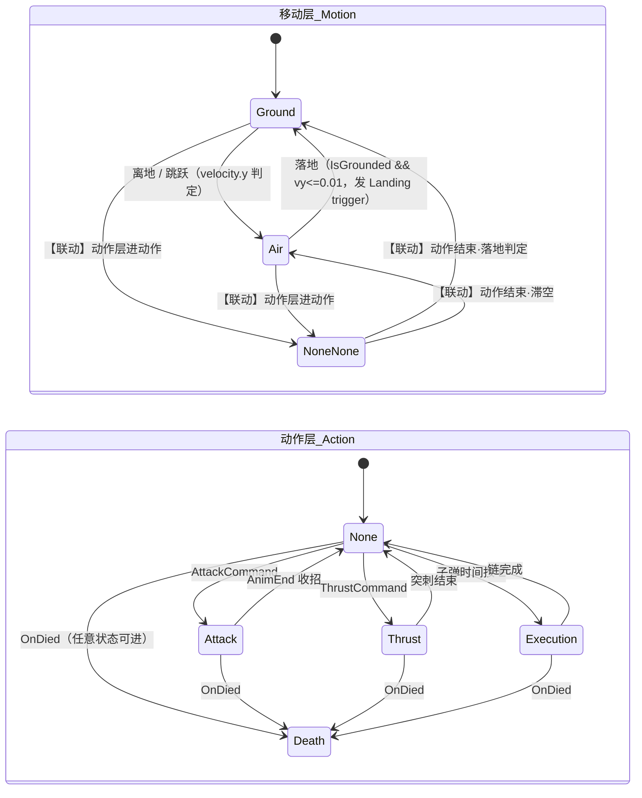

# 玩家状态机详解 — motion / action 双层互斥 FSM

> 本文是当前状态机的完整参考文档。架构速览见 [CLAUDE.md](CLAUDE.md)，给 Player 添加新能力的操作流程见 `.claude/skills/add-player-ability/`。
> 相关代码：[PlayerStateMachine.cs](Assets/Script/Player/PlayerStateMachine.cs)、[PlayerState.cs](Assets/Script/Player/PLAYERSTATE/PlayerState.cs)、[MotionStates.cs](Assets/Script/Player/PLAYERSTATE/MotionStates.cs)、[ActionStates.cs](Assets/Script/Player/PLAYERSTATE/ActionStates.cs)、[PlayerAnimatorComponent.cs](Assets/Script/Component/PlayerAnimatorComponent.cs)

---

## 1. 一图总览

```
Player.Update()
 └─ PlayerAnimatorComponent.RefreshUpdate()
     ├─ MotionMachine.Update()   ← 移动层：先驱动
     └─ ActionMachine.Update()   ← 动作层：后驱动（动作完成当帧即可恢复移动）

输入/事件侧                         状态机侧                    模块侧
──────────────                    ─────────                  ─────────
PlayerInputController ──Request──▶ PlayerStateMachine ──Enter──▶ PlayerState
IPlayerCommand       ◀──────────── 守卫裁决（拒绝式）              │
OnDied 事件          			   Exit ◀───                   └─调▶ PlayerModule（纯逻辑库）
动画事件(AnimEnd/AttackTrigger) ──▶ 组件回调 ──▶ 推进当前动作状态 / 出判定
```



（`NoneNone` 即移动层的 `None` 让位状态，mermaid 需避免与动作层 `None` 重名。）

**两层的互斥关系**：移动层回答"人在哪"（地面/空中），动作层回答"人在干什么"，但**任意时刻只有一台机有实际状态**。动作层进入 Attack/Thrust/Execution/Death 时移动层让位进 None；动作层回 None 时按物理事实（IsGrounded / velocity.y）恢复 Ground/Air。跨机联动集中在 `PlayerAnimatorComponent.HandleActionTransitioned`（订阅 `Transitioned` 事件），状态类不感知跨机事务。恢复到 Ground 时其 `Enter` 天然完成姿态交还（CrossFade 回 GroundMove）与跳跃次数重置——不再需要任何"让位/交还"补丁逻辑。

---

## 2. 设计原则（五条）

1. **依赖单向**：输入/命令/事件 → `Request(Id)` → 状态机 → 状态 `Enter` 调用模块。模块**不切状态**、不持有状态引用；需要复用的能力拆成模块核心方法（如 `Thrust.ThrustCore()` 供处决链复用）。
2. **逻辑归 C#，姿态权威也在 C#（动画三分法）**：Base 层姿态由状态 `Enter` 的 `CrossFade(animStateName)` 直控，Controller 的 Base 层**零转换、零 bool**；连续量（xvelocity/yvelocity）走 Blend Tree 帧内混合（参数由宿主 `RefreshUpdate` 每帧统一刷新，与状态机解耦——移动层让位进 None 期间也不冻结）；瞬时涟漪（Hit/Landing/flip）归 FX 事件层（trigger 进 → exit-time 自治回 Empty）。FSM 的正确性**不依赖任何动画剪辑事件**（`AnimEndTrigger` 仅用于攻击收招这类表现推进）。
3. **单一转换入口**：一切切换走 `machine.Request(id)`，内部经守卫裁决；`Current`/`CurrentId` 私有 set，外部不可篡改。
4. **守卫拒绝式**：未声明拒绝的转换一律允许；结构性规则（终态/互斥组）集中声明，新状态自动被覆盖，不存在漏写一对的静默漏洞。
5. **物理事实驱动移动层**：Ground↔Air 由 `velocity.y` / `IsGrounded` 判定，不受守卫表约束；Idle/Move/Jump 这些"纯动画差异"不设独立状态。动作期间物理事实不再持续跟踪，动作结束时由联动方法一次性判定恢复目标。
6. **互斥单活**：任意时刻只有一台机有实际状态（另一台在 None）。跨机联动集中在宿主的 `HandleActionTransitioned`（`Transitioned` 事件订阅），由事件在转换完成后触发——状态类不需要、也不应该在 Enter/Exit 里操作另一台机器。

---

## 3. 核心：`PlayerStateMachine<TId>`

泛型 FSM（`TId : struct`，即枚举），两层共用，位于 [PlayerStateMachine.cs](Assets/Script/Player/PlayerStateMachine.cs)、命名空间 `Frame_Player`。

### 3.1 数据结构

| 成员 | 类型 | 用途 |
|---|---|---|
| `states` | `Dictionary<TId, PlayerState>` | 注册表（`Register` 填充） |
| `forbidden` | `HashSet<(TId, TId)>` | 逐对禁令（`Forbid`） |
| `terminalStates` | `HashSet<TId>` | 终态集合（`ForbidAllFrom`） |
| `mutexGroups` | `List<TId[]>` | 互斥组（`ForbidAllBetween`） |
| `idleId` | `TId` | "空闲"锚点：两层均为 None；`IsBusy` 据此计算（`CurrentId != idleId`） |
| `transitioning` | `bool` | 重入防护标志 |
| `Transitioned` | `event Action<TId,TId>` | 真实转换完成后触发（自转换/守卫拒绝不触发）；跨机联动唯一入口 |

### 3.2 `Request(id)` 完整裁决流程

```csharp
machine.Request(Thrust)
 ├─ ① 未 Initialize？           → LogError + return false
 ├─ ② transitioning 中？        → LogWarning + return false   // 重入防护：Exit/Enter 内不可再切
 ├─ ③ 自转换（id == CurrentId）？→ 静默 return true            // 不触发 Exit/Enter
 ├─ ④ 目标未注册？               → LogError + return false
 ├─ ⑤ 守卫裁决 DenyReason()：
 │     终态检查（from ∈ terminalStates）         → "X 是终态"
 │     互斥组（from、to 同属一组）               → "X 与 Y 同属互斥组"
 │     逐对禁令（(from, to) ∈ forbidden）        → "逐对守卫规则"
 │     命中任一 → 可选 LogWarning + return false
 └─ ⑥ 执行转换（try/finally 包裹，期间 ② 兜底）：
       previous.Exit() → Current = next → CurrentId = id → next.Enter()
       （finally：transitioning 复位）→ Transitioned?.Invoke(from, to) → return true
```

要点：**先 `Exit` 旧状态、再赋值、后 `Enter` 新状态**；赋值先于 `Enter` 发生，所以 `Enter` 内读到的 `CurrentId` 已是新状态。任何在 Exit/Enter 内发起的 `Request` 都会被 ② 拒绝并警告——这是"模块不在生命周期回调里切状态"的结构保证。`Transitioned` 事件在 `transitioning` 复位**之后**触发，订阅者（宿主联动）可安全发起后续转换。

### 3.3 守卫三层 API

| API | 语义 | 适用场景 | 项目中的使用 |
|---|---|---|---|
| `ForbidAllFrom(id)` | id 是终态，拒绝一切转出 | 不可逆状态 | `ForbidAllFrom(Death)` |
| `ForbidAllBetween(...)` | 组内任意两状态互转全拒 | 同类互斥 | `ForbidAllBetween(Attack, Thrust, Execution)` |
| `Forbid(from, to)` | 单点禁令 | 个别例外 | 预留（如"某动作期间不可被死亡打断"） |

判定是**动态的**（Request 时实时检查），不是声明时展开成对——以后注册新状态（如 Dodge）只要加进互斥组，终态和互斥自动覆盖它。

### 3.4 其他成员

- `IsBusy`：`CurrentId != idleId`（泛化实现，摆脱对具体状态类型的耦合，两层通用）。动作层用它做"移动抑制"信号（`PlayerAnimatorComponent.IsActionBusy`，跳跃等命令入口据此禁用）。
- `Transitioned`：转换后事件，互斥模型的跨机联动唯一入口（见 §6.4）。
- `EnableTransitionLog`：打印每次转换与每次拒绝（含人话原因）。
- `Update()`：驱动 `Current.Update()`，由组件每帧调用（移动层在 None 让位期间同样被驱动，只是 `PlayerMotionNoneState.Update` 为空操作）。

---

## 4. 状态基类体系

```
PlayerState（抽象根，PlayerState.cs）
 ├─ MotionState（移动层基类，MotionStates.cs；仅在动作层空闲时活动）
 │    ├─ PlayerMotionNoneState // 让位锚点：动作层持锁期间停留，不应用输入不碰姿态
 │    ├─ PlayerGroundState   // 地面（姿态 = GroundMove 混合树）
 │    └─ PlayerAirState      // 滞空全程（姿态 = Jumping 混合树）
 └─ ActionState（动作层基类，ActionStates.cs）
      ├─ PlayerNoneState      // 空闲锚点；姿态交还由宿主联动恢复移动层时完成
      ├─ PlayerAttackState
      ├─ PlayerThrustState
      ├─ PlayerExecutionState
      └─ PlayerDeathState     // 终态
```

### `PlayerState` 字段约定

| 字段 | 说明 |
|---|---|
| `player` | 宿主引用，访问模块/组件/两台状态机的唯一入口 |
| `animStateName` | Base 层 Animator 状态名（离散状态或 BlendTree 状态）；`Enter` 时 `CrossFade` 过去。传 null 表示无对应动画（如 Execution/Death 暂缺剪辑），静默跳过 |
| `stateTimer` | 纯 float 计时（Enter 重置为 0.1f，子类可覆盖）——**不是** `Timer` 对象，避免注册进全局 Timers 列表造成泄漏 |
| `xInput` | 移动层水平输入缓存，每帧无条件刷新 |
| `AnimEndTrigger` | 动画剪辑 `AnimEnd` 事件经组件置位；仅表现推进用 |

姿态切换的可重写入口是 `FadeToAnimState()`（不是整个 `Enter`）：互斥模型下**没有任何子类需要重写它**——动作动画天然独占 Base 层（移动层在 None，`animStateName=null` 静默跳过）；动作结束后由联动方法恢复移动层，Ground/Air 各自的 `Enter → CrossFade` 天然完成姿态交还。`Exit` 不再清任何参数（没有 bool 可清）。

### 两个中间基类的分工

- **`MotionState.Update()`**：① 无条件刷新 `xInput`（防硬直期间残留旧值）；② 若 `IsIgnore(Move)` 则跳过 `ApplyHorizontal`（受击硬直/刹车待转抑制）。Blend Tree 连续量（xvelocity/yvelocity）已上移到宿主 `RefreshUpdate` 统一刷新，与本层解耦。
- **`PlayerMotionNoneState`**：让位锚点。`Update` 重写为**空操作**（必须——基类会应用移动输入）；`animStateName=null` 不碰姿态。恢复由宿主联动触发，本状态**不自愈**。
- **`ActionState`**：纯标记基类——动作层不碰移动输入、不同步 yvelocity，只调度模块 + 在完成条件满足时 `Request(None)`。

---

## 5. 移动层详解（`MotionStateId { None, Ground, Air }`）

| | **None（让位）** | **Ground** | **Air** |
|---|---|---|---|
| animStateName | null（不碰姿态）| `GroundMove`（Idle1/run 的 xvelocity 混合树）| `Jumping`（yvelocity 混合树）|
| Enter | 静默跳过 CrossFade | CrossFade(GroundMove) + `ResetJumps()` | CrossFade(Jumping) |
| Update | 空操作（必须重写——基类会应用输入）| base → `!IsGrounded && \|vy\|>0.01` 才转 Air（双条件防落地残余速度误判离地 → Landing 双播） | base → 落地判定（见下） |
| Exit | 无操作 | 无操作（无可清参数） | 无操作 |

**None 的进出均由宿主联动驱动**（`HandleActionTransitioned`）：动作层进动作 → `Request(None)`；动作层回 None → 按落地条件判定恢复目标（恢复到 Ground 时补发 `Landing` trigger——动作期间落地的涟漪被互斥推迟到动作结束补发，保持"落地必有涟漪"语义）。

**Air 的落地判定**：`IsGrounded && rb.velocity.y <= 0.01f`（允许微小下落速度，纯物理事实）→
1. `anim.SetTrigger("Landing")` — 落地涟漪交给 **FX 事件层**（trigger 进 → exit-time 自治回 Empty）；
2. `Request(MotionStateId.Ground)` — Base 层同时 CrossFade 回 GroundMove，两者自然重叠。

### 为什么没有 Idle/Move/Jump 状态

- **Idle/Move**：物理上都是"在地面"，区别只是速度值。`GroundMove` 混合树按 `xvelocity`（每帧由 MotionState 写入）连续取值，起步/刹车的渐变免费获得，没有转换间隙、没有一帧顿挫。
- **Jump**：起跳只是"Ground→Air + 给一个向上速度"，上升/apex/下落由 `Jumping` 树按 `yvelocity` 连续混合。二段跳 = Air 内再次 `ApplyJump`，yvelocity 回正自动重播上升段。

---

## 6. 动作层详解（`ActionStateId { None, Attack, Thrust, Execution, Death }`）

### 6.1 状态职责表

| 状态 | 进入途径 | Enter 做什么 | 退出条件 | Exit 做什么 |
|---|---|---|---|---|
| **None** | 初始态；各动作完成回归 | 静默（姿态交还由联动恢复移动层完成）| 命令/事件 Request | — |
| **Attack** | `AttackCommand`（需 动作层空闲+在地面+无 Action 忽略）| 清速度；`AddIgnore(attackIgnoreDuration, All)` 锁全动作；`Combat.BeginAttack()`（前冲 ForceMove + 时间戳）| attack 剪辑 `AnimEnd` 事件 | `BusyFor(attackRecovery)` 追加硬直 |
| **Thrust** | `ThrustCommand → Thrust.StartThrust()`：Request 成功才 `AddIgnore(thrustCooldown, Dash)` 占冷却 | `Thrust.ThrustCore()`（ForceMove + 重力归零协程，不占冷却）| `!Thrust.IsThrusting` | — |
| **Execution** | 子弹时间中按 E（`MarkCount > 0`）| `BulletTime.BeginExecution()` 启动链式处决协程 | `!BulletTime.IsExecuting` | — |
| **Death** | `healthManageComponent.OnDied` 事件（具名订阅）| 清速度、gravityScale=0、读 `deathAnimationDuration` | **终态，禁止转出** | — |

三个"执行型"状态（Attack/Thrust/Execution）的共同纪律：**状态只负责等待完成条件并 `Request(None)`**，落地/离地一律由宿主联动在动作结束时一次性判定（互斥设计的直接收益——旧版每个动作状态都要自己写"落地选 Idle 否则 Air"）。

### 6.2 跨机联动（互斥模型核心）

[PlayerAnimatorComponent.cs](Assets/Script/Component/PlayerAnimatorComponent.cs) 的 `HandleActionTransitioned` 订阅 `ActionMachine.Transitioned`：

```csharp
to == None（动作结束）:
    grounded = IsGrounded && velocity.y <= 0.01f   // 复用 Air 的落地条件
    grounded 时补发 SetTrigger("Landing")           // 动作期间落地的涟漪补发
    MotionMachine.ChangeState(grounded ? Ground : Air)
    // Ground.Enter: ResetJumps + CrossFade(GroundMove) —— 姿态交还与跳跃重置天然完成
to != None（进入动作，含动作中死亡）:
    MotionMachine.ChangeState(None)                 // 已是 None 时自转换静默
```

要点：
- **联动在转换完成后触发**（`transitioning` 已复位），无重入风险；状态类完全不感知跨机事务（依赖单向原则的延伸）
- **死亡天然安全**：Death 走"进动作"分支把 motion 压进 None；Death 是终态永不回 None，motion 永不恢复
- **初始化安全**：`Initialize()` 直接 Enter 不走 `ChangeState`，不触发事件；Awake→Start 间 CurrentId 为 default(None)，任何早期联动对 motion 切 None 是自转换，静默无害

### 6.3 转换规则全表（守卫裁决结果）

`✓` 允许 · `✗` 拒绝（括号内为日志原因）

| from ＼ to | None | Attack | Thrust | Execution | Death |
|---|---|---|---|---|---|
| **None** | 自转换 | ✓ | ✓ | ✓ | ✓ |
| **Attack** | ✓ 完成 | 自转换 | ✗（互斥组）| ✗（互斥组）| ✓ 死亡打断 |
| **Thrust** | ✓ 完成 | ✗（互斥组）| 自转换 | ✗（互斥组）| ✓ |
| **Execution** | ✓ 完成 | ✗（互斥组）| ✗（互斥组）| 自转换 | ✓ |
| **Death** | ✗（终态）| ✗（终态）| ✗（终态）| ✗（终态）| 自转换 |

守卫声明只有两行（[PlayerAnimatorComponent.cs](Assets/Script/Component/PlayerAnimatorComponent.cs) `Init()` 内）：

```csharp
ActionMachine.ForbidAllFrom(ActionStateId.Death);
ActionMachine.ForbidAllBetween(ActionStateId.Attack, ActionStateId.Thrust, ActionStateId.Execution);
```

动作层纪律可归纳为一句话：**进出经 None（进入从 None、完成回 None），Death 例外（任意状态可进、进去出不来）**。

### 6.4 守卫为什么不可省

模块/命令层的检查（如 `CanThrust = !IsIgnore(Dash)`）是**时间窗检查，有缝隙**：攻击的 `AddIgnore(All)` 只有 0.3s，若攻击剪辑更长，之后 Dash 已解禁但动作层还在 Attack——守卫是拦住"挥刀中途突刺"的最后一道结构防线；死亡后的输入并未切断，守卫同时防住"尸体突刺"（死后 `CanThrust` 仍为 true）。

---

## 7. 与 Animator 的分工（三分法）

| 层 | 内容 | 谁驱动 |
|---|---|---|
| **Base 层**（零转换）| GroundMove（xvelocity 树）/ Jumping（yvelocity 树）/ attack1 / Dash | C# 状态 `Enter` 的 `CrossFade(animStateName, 0.12)` 直控；注册表见 `PlayerAnimatorComponent.Init()` |
| **FX 事件层**（自治涟漪，defaultWeight=0）| hit / landing / Turnflip，Empty 空态归位 | trigger 进（C# 只发 trigger：`Hit`/`Landing`/`flip`）→ exit-time 出，播完自动消失，不碰 Base 拓扑；层权重由宿主 `RefreshUpdate` 每帧轮询（Empty=0 完全让位 Base 层，涟漪=1 接管输出）——层权重不影响 FX 层对 trigger 的响应，只影响输出混合（sprite 不可层间混合，权重 1 的空层会覆盖 Base 层输出，这是必须轮询归零的原因） |

**剩余 Animator 参数全表**：

| 参数 | 类型 | 谁写 | 谁消费 |
|---|---|---|---|
| `xvelocity` | float | 宿主 `RefreshUpdate()` 每帧（与状态机解耦，让位期间不冻结）| GroundMove 树（Idle1↔run）|
| `yvelocity` | float | 宿主 `RefreshUpdate()` 每帧（同上）| Jumping 树（上升/apex/下落）|
| `Hit` | trigger | DamageComponent 受击 | FX 层 hit |
| `Landing` | trigger | Air 落地时发一次；联动恢复到 Ground 时补发一次（动作期间落地）| FX 层 landing |
| `flip` | trigger | PlayerLocomotion 反向输入翻转时（`SetMoveInput` 中 `Flip()` 后）| FX 层 Turnflip |

分工原则：**姿态选择的权威是 C#（注册表即映射文档）；帧内连续混合归 Blend Tree；瞬时表现归 FX 层**。bool 网络及其 bug 类别（AnyState 重触发、死参数、Entry 分发断裂）从机制上绝迹。改混合手感只需调 `CrossFadeDuration`（Inspector）或树的阈值。

---

## 8. 典型路径走查

### 8.1 跳跃（含二段跳）
```
按 Space → JumpCommand.CanExecute(CanJump = !IsActionBusy && !IsIgnore(Jump) && RemainingJumps>0)
  → ApplyJump(): rb.velocity.y = jumpForce → MotionMachine.Request(Air) → ConsumeJump
  → Air.Enter: CrossFade("Jumping")
  → Jumping 树按 yvelocity 连续混合：上升段 → apex → 下落段
落地 → Air.Update 判定 → SetTrigger("Landing")（FX 层涟漪）→ Request(Ground)
  → Ground.Enter: CrossFade("GroundMove") + ResetJumps
二段跳：Air 中再次 ApplyJump——Request(Air) 自转换静默成功；yvelocity 回正树自动回上升段
```
`!IsActionBusy` 是互斥约定的一部分：动作持锁期间移动层在 None，跳跃不得将其拉出（CanJump 一处门控同时覆盖正常模式与子弹时间模式的跳跃入口）。

### 8.2 攻击
```
按鼠标左键 → AttackCommand.CanExecute(动作层==None && IsGrounded && !IsIgnore(Action))
  → ActionMachine.Request(Attack) → 守卫(None→Attack ✓)
  → Attack.Enter: CrossFade("attack1") + 清速度 + AddIgnore(0.3, All) + Combat.BeginAttack(前冲 ForceMove)
  → Transitioned 事件 → 联动: MotionMachine.Request(None)（移动层让位，不应用输入不碰姿态）
attack 剪辑中段: AttackTrigger 事件 → Combat.HitDetect() 生成 Hitbox
attack 剪辑末尾: AnimEnd 事件 → ActionMachine.Current.Trigger() → AnimEndTrigger=true
  → Attack.Update: Request(None) → Transitioned 事件 → 联动: 落地判定恢复移动层
  → Ground.Enter: CrossFade("GroundMove") + ResetJumps（姿态交还天然完成）
```

### 8.3 突刺
```
按 S → ThrustCommand.CanExecute(CanThrust) → Thrust.StartThrust()
  → Request(Thrust) 成功才 AddIgnore(thrustCooldown, Dash)   // 守卫拒绝时不白白吞冷却
  → ThrustState.Enter → Thrust.ThrustCore(): ForceMove + 重力归零协程
  → Transitioned 事件 → 联动: MotionMachine.Request(None)
  → Update 等 !IsThrusting → Request(None) → 联动按物理事实恢复移动层
  突刺中按跳跃：CanJump 因 !IsActionBusy 为 false，无响应（动作完整性优先）
```

### 8.4 链式处决（状态机不参与逐跳切换）
```
右键进子弹时间 → 左键标记敌人 → 按 E
  → PlayerInputController: Request(Execution) → ExecutionState.Enter → BeginExecution()
  → Transitioned 事件 → 联动: MotionMachine.Request(None)（处决全程移动层让位）
ExecuteChain 协程（每跳）:
  瞬移到目标前 → Thrust.ThrustCore()（复用位移核心，不切状态、不占冷却）
  → anim.CrossFade("Dash") 手动维持视觉 → 造成伤害 → 残影循环
链结束 → IsExecuting=false → ExecutionState.Update → Request(None)
  → 联动按物理事实恢复移动层（瞬移跨越空中/地面，结束时一次性判定）
```
状态机全程停在 Execution——这正是守卫表存在的意义：链期间任何 Attack/Thrust 请求都会被互斥组拒绝。

### 8.5 受击（不切状态！）
```
Hitbox 命中 → Entity.Hit → DamageComponent.Hit
  → Owner.Interrupt() + anim.SetTrigger("Hit") + ForceMove(击退) + AddIgnore(hitRepel.length, All)
```
受击**不进入任何状态**：表现为当前动画上的 Hit trigger 叠加 + 位移击退 + 动作忽略（移动层因 `IsIgnore(Move)` 停止应用输入）。硬直是时间窗，不是状态。

### 8.6 死亡
```
OnDied 事件 → PlayerAnimatorComponent.HandleOnDied → ActionMachine.Request(Death)
  → 任意状态可进（含 Attack/Thrust/Execution 中）→ Death.Enter: 清速度、零重力
  → Transitioned 事件 → 联动: MotionMachine.Request(None)（若是动作中死亡则自转换静默）
  → stateTimer 归零后启动协程 → 延迟 deathAnimationDuration → 重载场景
守卫: Death 是终态，之后任何 Request 一律拒绝（尸体不会突刺/不会"复活"回 None）
  → 联动的恢复分支永不触发 → 移动层永久停在 None —— 互斥约定在死亡路径天然闭合
```

---

## 9. 输入到状态的完整链路

```
InputManager（键位状态缓存）
  → PlayerInputController.OnUpdate（IManager，双模式：正常 / 子弹时间）
      ├─ SetMoveInput(MoveInput)          → Locomotion.HorizontalInput（移动层消费）
      ├─ TryExecute(Jump/Thrust/Attack)   → IPlayerCommand.CanExecute / Execute
      │     JumpCommand    → Locomotion.ApplyJump() → Request(Air)
      │     ThrustCommand  → Thrust.StartThrust()   → Request(Thrust)
      │     AttackCommand  → 直接 Request(Attack)
      └─ 子弹时间模式: 移动/跳跃照常 + 瞄准/标记 + E → Request(Execution)
```

命令层做**输入侧门控**（null 检查、冷却、地形、硬直），状态机做**结构侧门控**（守卫表），两层各司其职、互为保险。

---

## 10. 如何扩展

### 加一个动作层状态（例：Dodge 闪避）
1. `ActionStateId` 加 `Dodge`；MotionStates/ActionStates 文件里加状态类（继承 `ActionState`）
2. `PlayerAnimatorComponent.Init()` 注册：`ActionMachine.Register(Dodge, new PlayerDodgeState(Owner, "Dodge"))`
3. 加入互斥组（一词之改）：`ForbidAllBetween(Attack, Thrust, Execution, Dodge)`
4. 命令/输入绑定/配置走 `.claude/skills/add-player-ability/` 的标准流程

### 三段式动画（开始/循环/结束）
intro/loop/outro 作为 Base 层内的状态链由 Animator 编排（intro exit-time → loop 循环 → outro 条件+exit-time），C# 的 `animStateName` 指向 intro 状态，不感知动画段：
- **outro 只是视觉收尾**：状态正常 Exit → 联动恢复移动层姿态，用 `BusyFor` 锁输入——攻击收招就是这个模式；
- **C# 要等 outro 播完**：结束条件满足时 `SetTrigger("{Name}End")` 让控制器过渡到 outro，等 outro 剪辑末尾的 `AnimEnd` 事件 → `AnimEndTrigger` 置位 → 再 `Request(None)`（可配合 `stateTimer` 做超时兜底）。段间推进用 trigger、姿态整体切换用 CrossFade——两个机制各司其职，与 FX 层的 trigger 不冲突（`{Name}End` 属于 Base 层内部序列）。

### 明确不做的事
- 不做动画段感知/子状态机（三段各有独立玩法逻辑时应拆成多个动作状态经 None 串联）
- `AnimEnd` 只路由到动作层（移动层 outro 走视觉收尾模式）
- 移动层不设守卫（物理事实不做规则限制）

---

## 11. 调试

Player 预制体 → PlayerAnimatorComponent → 勾选 **Enable Transition Log**，Console 输出：

```
[Motion] Ground → Air
[Action] None → Attack
[Action] Attack → None
[Action] 拒绝转换 Attack → Thrust（Attack 与 Thrust 同属互斥组）
[Action] 拒绝转换 Death → Thrust（Death 是终态）
[Action] 转换进行中拒绝了并发的 Request(None) —— 状态的 Exit/Enter 内不允许再切状态
```

| 日志 | 含义 / 排查方向 |
|---|---|
| `拒绝转换 X → Y（同属互斥组）` | 动作未完成就想进另一动作——通常是命令层缺状态检查（如 CanThrust 未查动作层），守卫兜住了 |
| `拒绝转换 Death → Y（终态）` | 死亡后仍有代码试图切状态——按调用栈定位 |
| `转换进行中拒绝了...` | 某状态的 Enter/Exit 里发起了 Request——把切换挪到 Update 或外层 |
| `Request 的目标状态 X 未注册` | 枚举加了值但 Init 忘了 Register |
| `尚未 Initialize，忽略 Request` | 生命周期问题：早于 Player.Start 的调用（命令层已有 null 防护，出现说明新调用点缺防护）|

---

## 12. 已知边界与限制

| 项 | 现状 | 影响 / 可选修法 |
|---|---|---|
| ~~死亡后可跳跃~~ | 已修复：`CanJump` 含 `!IsActionBusy`，Death 属动作状态即 IsBusy | — |
| 死亡后可进子弹时间 | `EnterBulletTime` 无死亡检查 | 同上量级；要修：入口加 `!IsActionBusy` 检查 |
| 动作期间落地涟漪延迟 | 互斥模型下物理事实在动作结束时一次性判定，Landing trigger 补发于收招时 | 从高处落地攻击时涟漪稍迟；若在意可在动作期间由 DetectionComponent 侧发即时反馈 |
| 突刺中不可跳跃 | `CanJump` 含 `!IsActionBusy`（互斥约定，行为变更）| 原正交模型下"突刺中跳"是无锁副产物；若想恢复需为跳跃设计专门豁免通道 |
| Execution / Death 无动画状态 | 两状态 `animStateName = null`，静默跳过 CrossFade | 补美术资产后改注册表第二个参数即可，其余代码不动 |
| 落地阈值 0.01f | 对坡面/细碎碰撞敏感，可能 Ground↔Air 抖动 | 若实测出现，抬高阈值或给 Ground 加"离地容错帧" |
| AnimEnd 只到动作层 | 移动层状态收不到动画结束事件 | 移动层 outro 均为视觉收尾模式，无需求；真需要时改组件 AnimEnd 双路由 |
